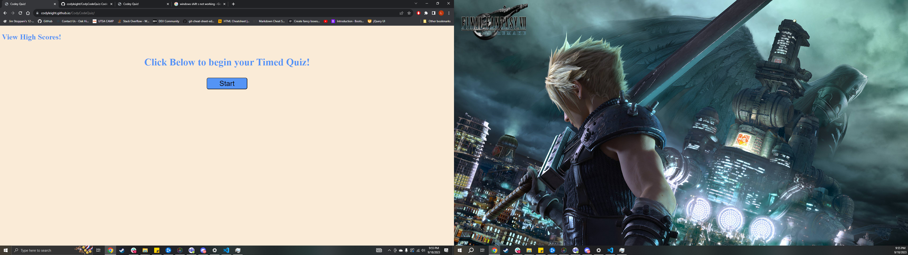

# Week 4 Challenge - Timed Quiz

## Description

Fourth Week - Creating a multiple choice quiz, which when started a timer will start counting down. Answers from quiz will be saved at the end and calculated up.

## Links

Github Link: https://github.com/codyleight/CodyCodeQuiz
Deployed Website : https://codyleight.github.io/CodyCodeQuiz/

## Usage

A showcase for a multiple choice quiz, with a highscore and data selectors for correct answers.
## Credits

Cody Thompson
Repo location on pc: - C:\Users\JC\Desktop\Bootcamp2\CodyCodeQuiz
used w3 schools and other examples.

## Photo Preview of Website
 
